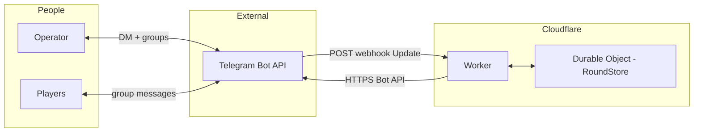
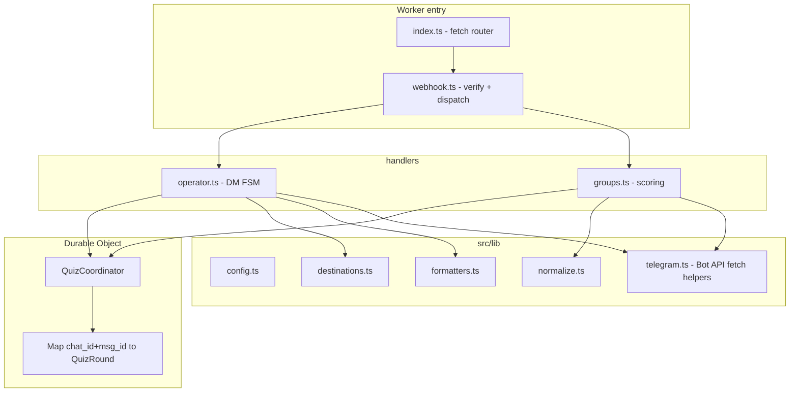
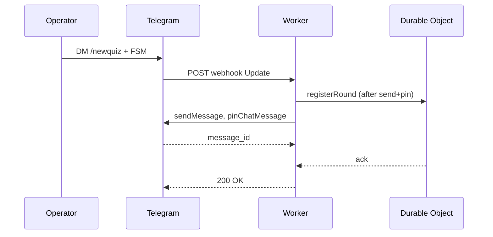
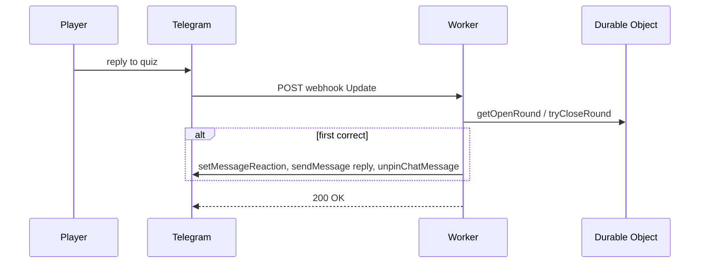

# Architecture: bilbo-s-riddles (Telegram quiz bot)

**Chosen deployment**: **Cloudflare Workers** + **Telegram webhooks** + **Durable Objects** for round state. **Constitution v1.4.0** also requires **MCP-First**: agent-facing capabilities MUST be exposed as **MCP tools** (`@modelcontextprotocol/sdk`, **Zod**)—typically a **stdio MCP server** (Node/TypeScript) in-repo alongside the Worker (see [`plan.md`](../specs/001-telegram-quiz-bot/plan.md)). Product behavior matches [`specs/001-telegram-quiz-bot/spec.md`](../specs/001-telegram-quiz-bot/spec.md).

**§12** documents a **non-default** path (Python long polling on a VPS) for comparison only—not the current decision.

## 1. Purpose

A **Telegram bot** implemented as a **Worker** receives updates via **HTTPS webhook**, lets a **trusted operator** publish quizzes to **play** or **optional test** supergroups, **pins** each quiz post, scores **only threaded replies** to that post, **normalizes** answers, and on first correct reply **reacts**, **replies with the explanation**, and **unpins** that quiz. **Multiple rounds** per chat; state is **scoped by chat** and **quiz message id**, stored in a **Durable Object** so it survives Worker isolate restarts.

## 2. System context

- **Operator** uses **private DM** (allowlisted) and **groups** as in the spec; Telegram delivers all updates to the **Worker** URL.
- **Players** interact in **play** / **test** supergroups; the bot uses `fetch` to Telegram for `sendMessage`, pins, reactions, etc.

## 3. Container (deployment view)

| Element | Responsibility |
|---------|----------------|
| **Cloudflare Worker** | HTTP entry (`POST /webhook`); validates secret token; routes to handler; calls Telegram Bot API via `fetch`. |
| **Durable Object (e.g. `QuizCoordinator`)** | Holds authoritative **open rounds** map and **serialization** per bot (single DO id for the whole bot is simplest). |
| **wrangler.toml + secrets** | Routes, `BOT_TOKEN`, `WEBHOOK_SECRET`, `PLAY_CHAT_ID`, optional `TEST_CHAT_ID`, `OPERATOR_USER_IDS`, vars. Nothing secret committed. |

**Webhook setup**: After deploy, call `setWebhook` with the Worker URL and optional `secret_token`; Worker rejects POSTs without the expected header.

## 4. Logical components (TypeScript)

| Component | Role |
|-----------|------|
| **webhook** | Verify `X-Telegram-Bot-Api-Secret-Token`; parse `Update`; delegate to operator vs group handler. |
| **config** | Typed access to env / bindings (Wrangler). |
| **destinations** | Resolve `play` \| `test` → `chat_id`. |
| **formatters** | Public quiz message text (no answer leak); final line = posting operator’s Telegram-visible attribution (FR-008a). |
| **normalize** | Same rules as [`research.md`](../specs/001-telegram-quiz-bot/research.md) (casefold, whitespace, punctuation)—**unit-tested**. |
| **telegram** | Thin `callMethod(method, body)` to `api.telegram.org`. |
| **QuizCoordinator DO** | `registerRound`, `getOpenRound`, `tryCloseRound` with **single-threaded** semantics inside the DO (first-wins without distributed locks). |
| **handlers/operator** | DM FSM for `/newquiz` flow. |
| **handlers/groups** | Scoring path for supergroup `message` updates with `reply_to_message`. |
| **internal-api** | `POST /api/internal/publish`, `GET /api/internal/open-rounds` — Bearer `INTERNAL_API_SECRET`; Worker then uses `BOT_TOKEN` and DO stub (MCP never sees the token). |
| **mcp/** (stdio) | Node process: Zod-validated tools that `fetch` the Worker’s public URL; see [`mcp/README.md`](../mcp/README.md). |

Handler rules: [`telegram-handler-contracts.md`](../specs/001-telegram-quiz-bot/contracts/telegram-handler-contracts.md).

## 5. Data and identity

- **Round key**: `(chat_id, quiz_message_id)` inside the DO’s map.
- **Chat isolation**: Test vs play enforced by `chat_id` (`FR-010`).
- **Lifecycle**: `OPEN` → `WON` with reaction, explanation reply, unpin.

Entity fields: [`data-model.md`](../specs/001-telegram-quiz-bot/data-model.md).

## 6. Sequence: publish a quiz

## 7. Sequence: score a reply

## 8. Cross-cutting concerns

| Concern | Approach |
|---------|----------|
| **Security** | Webhook secret token; operator allowlist; Worker secrets for `BOT_TOKEN`. |
| **Observability** | `console.log` JSON lines: `round_id`, `chat_id`, `message_id`; never log token or full bodies (constitution). |
| **Resilience** | Retry/backoff on Telegram 429 inside Worker; return 200 quickly if using deferred pattern (optional). |
| **Concurrency** | **Durable Object** serializes requests to one bot state—natural “first wins.” |
| **Testing** | **Vitest** for `normalize` and pure helpers; DO logic tested with `@cloudflare/vitest-pool-workers` or integration tests; mocks must match **real** Telegram JSON shapes. |

## 9. Out of scope (v1)

- Separate web dashboard; channel-as-quiz-surface (groups/supergroups only).
- Fuzzy matching beyond defined normalization.
- Multi-region **active/active** for the same bot (single DO is single point of serialization—acceptable for small groups).

## 10. Cloudflare specifics (checklist)

- [ ] `wrangler.toml`: Worker + Durable Object binding + migration SQL if D1 ever added.
- [ ] `setWebhook` URL matches deployed route; **HTTPS** only.
- [ ] `secret_token` set and verified on every webhook POST.
- [ ] GrammY or minimal `fetch`—keep dependencies small (Principle IV).

## 11. Related documents

| Document | Path |
|----------|------|
| Feature spec | `specs/001-telegram-quiz-bot/spec.md` |
| Implementation plan | `specs/001-telegram-quiz-bot/plan.md` |
| Research & decisions | `specs/001-telegram-quiz-bot/research.md` |
| Data model | `specs/001-telegram-quiz-bot/data-model.md` |
| Contracts | `specs/001-telegram-quiz-bot/contracts/` |
| Runbook | `specs/001-telegram-quiz-bot/quickstart.md` |
| Constitution | `.specify/memory/constitution.md` |

## 12. Alternative (not selected): Python + long polling

A **long-lived Python** process (**aiogram**) calling `getUpdates` can implement the **same** spec with an **in-memory** `RoundStore` (lost on restart). Useful for local dev or if you move off Cloudflare. **Not** the chosen hosting for this repository going forward.
